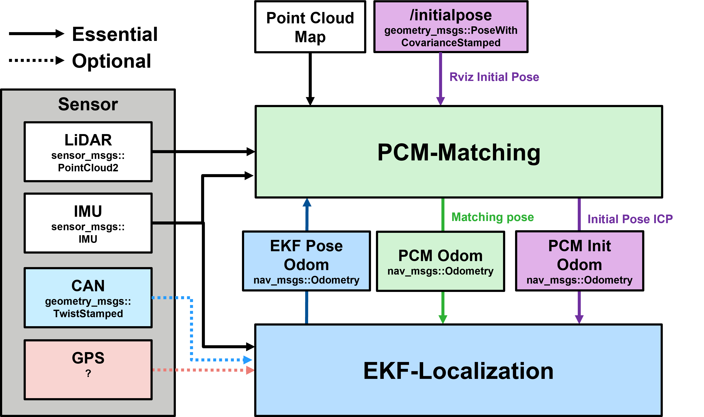
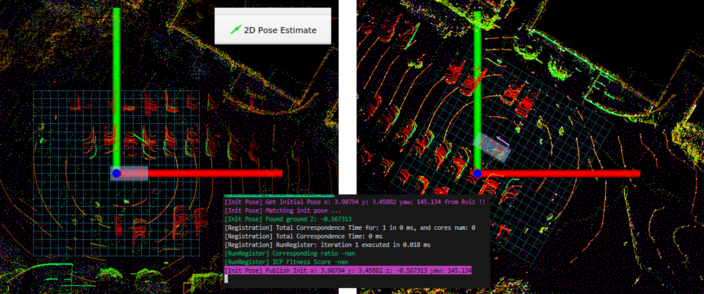

# ELiMaLoc
**EKF-based LiDAR-Inertial Map matching Localization**
> **Note**
> This code is still undergoing stabilization, but it is currently usable.

## Demo Video
<p align="center">
    <a href="https://youtu.be/oegzw7mTZOk">
        
    </a>
</p>

## Real Vehicle Autonomous Driving Demo

<p align="center">
    <a href="https://youtu.be/QKdCpk5b0EE">
        
    </a>
</p>

## TODO 
1. CUDA based ICP
2. Localization evaluation on public dataset

## Menu
- [System Architecture](#system-architecture)
- [Dependency](#dependency)
- [How to use](#usage)
- [EKF Localization](#ekf_localization)
- [PCM Matching](#pcm_matching)
- [Parameter Settings](#parameter-settings)
- [Test record file](#test-record-file)

# System Architecture

<p align='center'>
    
</p>

### Packages
- `ekf_localization`: 24-DOF EKF-based localization
- `pcm_matching`: Point cloud Map Matching

### Folder Structure
```
localization/
├─ ekf_localization/
├─ localization_interface/
├─ pcm_matching/
└─ README.md
```

# Dependency
### 1. Install ROS messages and other libraries
* for Ubuntu 20.04 (noetic)
```bash
sudo apt install ros-noetic-jsk-rviz-plugins ros-noetic-ros-numpy ros-noetic-nmea-msgs ros-noetic-gps-common ros-noetic-can-msgs ros-noetic-derived-object-msgs
```
* other libraries
```bash
sudo apt install net-tools libpugixml-dev libgeographic-dev rospack-tools libeigen3-dev liblapack-dev pkg-config swig cmake 
sudo apt-get install ros-noetic-mrt-cmake-modules
```
*  Georgia Tech Smoothing and Mapping library
```bash
sudo add-apt-repository ppa:borglab/gtsam-release-4.0
sudo apt install libgtsam-dev libgtsam-unstable-dev
```

# How to use
### 1. Install
Clone code as workspace
```bash
git clone https://github.com/jaeyoungjo99/ELiMaLoc.git
cd ELiMaLoc
catkin_make
```
### 2. Configure localization.ini, calibration.ini
config/localization.ini   
config/calibration.ini

### 3. Place the point cloud map file
resources/map/pcm 
### 4. Modify ekf_localization.launch, pcm_matching.launch
1. ekf_localization
- Set location parameters. Modify ref lat, lon, hgt if necessary
- Set /use_sim_time to true when using bag data
2. pcm_matching
- Set location parameters. Modify map_path if necessary
- Set /use_sim_time to true when using bag data
### 5. Run launch
`location`: location name in launch file   
`bag`: true or false for using bag data
1. Launch at once
```bash
roslaunch launch/ELiMaLoc.launch location:=hanyang bag:=true
```
2. Launch each
```bash
rviz -d $(rospack find ekf_localization)/rviz/ekf_localization_rviz.rviz
roslaunch ekf_localization ekf_localization.launch
roslaunch pcm_matching pcm_matching.launch
```
### 6. Initialize Pose via Rviz Click (when not using GPS)
<p align='center'>
    
</p>

See [CallbackInitialPose](src/app/localization/pcm_matching/src/pcm_matching.cpp#L365) function for more details.

1. Change Views Type to `TopDownOrtho`
2. Click the green `2D Pose Estimate` on the top panel and drag in the desired direction
3. Check the terminal for the purple `[Init Pose] Publish Init ...` message
4. If `[Init Pose] ICP failed!` appears, click again to reinitialize


# `ekf_localization`
## Purpose and Features
### IMU-based EKF State Estimation
  - 24-DOF EKF for IMU gravity estimation and bias removal (refer to FAST-LIO equations)
  - Supports various state updates (PCM, GPS, NavSatFix, CAN)
  - Supports ZUPT through vehicle stop detection    

## I/O
- Input
  - IMU data sensor_msgs/Imu
  - Update
    - PCM estimated position nav_msgs/Odometry
    - PCM estimated initial position nav_msgs/Odometry
    - NavSatFix nav_msgs/NavSatFix
  - CAN
    - Basic CAN geometry_msgs::TwistStamped
- Output
  - Estimated position nav_msgs/Odometry

# `pcm_matching`
## Purpose and Features
### Point cloud Map Matching
- Point cloud Deskewing
- Voxel Hashing-based map structuring and nearest point search
- Supports various ICP methods (P2P, GICP, VGICP, AVGICP)
- Supports initial position setting via Rviz click (/init_pose)
- Detailed description: [PCM Matching README.md](src/app/localization/pcm_matching/README.md)
## I/O
- Input
  - Estimated position nav_msgs/Odometry
  - Point cloud sensor_msgs/PointCloud2
- Output
  - Estimated position nav_msgs/Odometry (Position, Covariance)
  - PCM visualization sensor_msgs/PointCloud2

# `localization_interface`
## Purpose
- Provides key functions and structures for localization algorithms
  - Functions related to Lie Algebra, structures related to EKF State

# Parameter Settings
 /config/localization.ini

## [common_variable]
- Sensor settings and basic coordinate system settings
  - `lidar_type`: Type of LiDAR to use (velodyne, ouster)
  - `lidar_scan_time_end`: 1 if LiDAR time is 0.0 for the last point, otherwise 0
  - `lidar_time_delay`: LiDAR delay (sec)
  - `lidar_topic_name`: LiDAR topic name (sensor_msgs/PointCloud2)
  - `can_topic_name`: CAN topic name (geometry_msgs/TwistStamped)
  - `imu_topic_name`: IMU topic name (sensor_msgs/Imu)
  - `navsatfix_topic_name`: NavSatFix topic name (sensor_msgs/NavSatFix)
  - `projection_mode`: Coordinate system projection method (Cartesian, UTM)

## [ekf_localization]
- EKF algorithm settings
  - Debug output
    - `debug_print`: Whether to output debug input data
    - `debug_imu_print`: Whether to output IMU debug
  - IMU settings
    - `imu_gravity`: Initial value of gravitational acceleration
    - `imu_estimate_gravity`: Whether to estimate gravitational acceleration
    - `use_zupt`: Whether to use ZUPT
    - `use_complementary_filter`: Whether to use Complementary Filter (forced in BESTPOS mode)
  - GPS settings
    - `gps_type`: GPS type (0: INSPVAX, 1: BESTPOS and BESTVEL, 2: NavSatFix)
    - `gnss_uncertainy_max_m`: Maximum cov limit for GPS input
  - Sensor usage
    - `use_gps`: Use GPS update
    - `use_imu`: Use IMU prediction (if not used, CA model prediction using ROS Time)
    - `use_can`: Use CAN speed update
    - `use_pcm_matching`: Use PCM matching
  - CAN settings
    - `can_vel_scale_factor`: CAN speed scale factor
  - Initial state and uncertainty
    - `ekf_init_x/y/z_m`: Initial position
    - `ekf_init_roll/pitch/yaw_deg`: Initial attitude
    - `ekf_state_uncertainty_*`: State uncertainty settings
    - `ekf_imu_uncertainty_*`: IMU sensor uncertainty settings
    - `ekf_imu_bias_cov_*`: IMU bias uncertainty settings
    - `ekf_gnss_min_cov_*`: Minimum GPS uncertainty settings
    - `ekf_can_meas_uncertainty_*`: CAN measurement uncertainty settings

## [pcm_matching]
- PCM matching settings
  - Debug output
    - `debug_print`: Whether to output debug
  - Map settings
    - `pcm_voxel_size`: Voxel size (m) (recommended 0.5 ~ 2.0)
    - `pcm_voxel_max_point`: Maximum points in a voxel (search speed slows if too large for P2P, GICP) (recommended ~50)
  - Input preprocessing
    - `input_max_dist`: Input point cloud distance filtering (recommended ~100)
    - `input_index_sampling`: Point cloud index sampling (recommended 5 or more)
    - `input_voxel_ds_m`: Input point voxel sampling size (recommended 1.0 ~ 2.0)
  - ICP settings
    - `icp_method`: ICP method selection (0: P2P, **1: GICP**, 2: VGICP, 3: AVGICP)
    - `max_iteration`: Maximum ICP iterations
    - `max_search_dist`: Maximum search distance for correspondences (m) (recommended ~5.0)
    - `lm_lambda`: Levenburg lambda value (recommended ~0.5)
    - `icp_termination_threshold_m`: ICP termination translation+angle threshold (recommended ~0.02)
    - `min_overlap_ratio`: Minimum overlap ratio with map (0 ~ 1.0)
    - `max_fitness_score`: Maximum fitness score considered as ICP success (recommended ~0.5)
    - `gicp_cov_search_dist`: Search range for cov calculation around target points in GICP (recommended 0.5 ~ 1.0)
  - Radar settings
    - `use_radar_cov`: Whether to use radar cov (0: do not use radar cov)
    - `doppler_trans_lambda`: 0.0 geometric, 1.0 doppler (applies only when use_radar_cov is 1)
    - `range_variance_m`: Radar distance uncertainty
    - `azimuth_variance_deg`: Radar horizontal resolution uncertainty
    - `elevation_variance_deg`: Radar vertical resolution uncertainty
# Test record file
### Hanyang University - [Google Drive](https://drive.google.com/drive/folders/1TAqY0102CSjbJHfW3_qR7VP3j8kbSD4L?usp=sharing)
```
hanyang_gps_imu_velodyne
├─ 37.238551_126.772530_0.000000_kcity_1203_filtered_02.pcd
├─ hanyang_loop.7z (.bag file)
└─ calibration.ini
```

### K City - [Google Drive](https://drive.google.com/drive/folders/1OwCfnxhYPpe8f1wP9jFGlpPVwOeegtaO?usp=sharing)
```
kcity_gps_imu_velodyne
├─ 37.558200_127.044500_66.000000_hanyang_02m.pcd
├─ kcity_loop.7z (.bag file)
└─ calibration.ini
```

# References
- EKF State Estimation: [FAST-LIO2](https://github.com/hku-mars/FAST_LIO) Xu, Wei, et al. (HKU MARS Lab)
- ICP Framework: [KISS-ICP](https://github.com/PRBonn/kiss-icp) Vizzo, Ignacio, et al. (PRBonn Lab)
- ICP Methodology: [FAST GICP](https://github.com/koide3/fast_gicp) Koide, Kenji, et al. (Tokyo Institute of Technology)
- Deskewing and Utility Functions: [LIO-SAM](https://github.com/TixiaoShan/LIO-SAM) Shan, Tixiao, et al. (Harbin Institute of Technology)
- Lie Algebra Functions: [Sophus](https://github.com/strasdat/Sophus) Strasdat et al.

# README Version History
- 2024/11/19: Initial version (Jaeyoung Jo wodud3743@gmail.com)
- 2024/12/05: ini modification (Jaeyoung Jo wodud3743@gmail.com)
- 2024/12/11: Final modification (Jaeyoung Jo wodud3743@gmail.com)
- 2024/12/18: Remove private dependency (Jaeyoung Jo wodud3743@gmail.com)
- 2024/12/19: Add private test record file (Jaeyoung Jo wodud3743@gmail.com)
